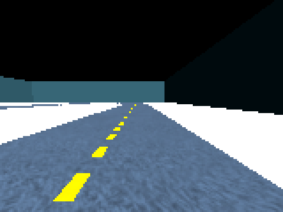
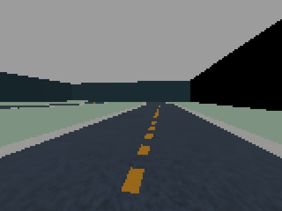
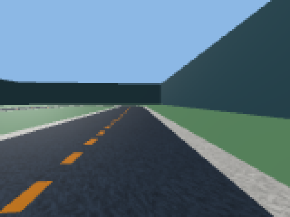

# Renderers

Camera training needs pixels, and there are three ways to make them. The
same scene, same track, same camera, three renderers:

| Madrona (default) | Nyx (path tracer) | CPU rasterizer |
|---|---|---|
|  |  |  |

*(Onboard camera at native 160×120, upscaled 3× nearest-neighbour. Madrona
is flat-shaded and fast; Nyx ray-traces real lighting and shadows; the CPU
rasterizer is the no-GPU fallback.)*

## Comparison

| | **Madrona** | **Nyx** | **CPU rasterizer** |
|---|---|---|---|
| What it is | batched GPU rasterizer (one megakernel renders all envs) | GPU path tracer (ray-traced light transport) | one CPU camera per env |
| Select with | `CameraEnvironment(render="madrona")` — the default | `CameraEnvironment(render="nyx")` | `CameraEnvironment(backend="cpu")` (wins over `render`) |
| Measured rollout throughput¹ | ~9.5k–18k env-steps/s | ~1.5k env-steps/s (**≈11× slower**) | ~90 env-steps/s *training* incl. PPO (4 envs, no GPU at all) |
| Visual fidelity | flat-shaded, no shadows | ray-traced lighting, shadows, true texture colors | flat-shaded |
| Multi-track zoo tiling | yes | yes (all K meshes load into every env — watch memory, see the build warning) | yes |
| World-color DR | yes | yes | yes |
| Camera-mount jitter DR | yes (batched attach offsets) | **no** — one shared sensor, no per-env mounts | yes (per-env cameras) |
| Per-env sky (`env_map_*` DR) | no (lights are replicated identically) | **yes** (Nyx-only `EnvironmentMapAsset`s) | no |
| Cars see other envs' cars | no (per-env worlds) | no (per-env worlds) | **yes** — ghost cars: all envs share the raster scene (verified empirically; they never collide, physics stays per-env) |
| Role | camera **training** | photorealism / sim2real studies, small-N | no-GPU camera training (works end-to-end, ~30× too slow for real runs), debugging, CI |

¹ 64–128 envs at 160×120 on an RTX 4060 Ti, constant-action rollout
(recorded by the `best_camera` notebook's bench stage). PPO training runs
several times slower than rollout on every renderer; the *ratio* between
renderers is what transfers. In practice the 11× gap is why the
`best_camera` experiments train on Madrona: at Nyx speed, one 10M-step run
consumes the GPU-hours that otherwise fund an entire HPO study.

The [DR catalog](../reference/dr-catalog.md) carries this compatibility
matrix as data, and `ExperimentSpec.validate()` enforces it — a spec that
asks Nyx for camera-mount jitter, or Madrona for `env_map` sky DR, refuses
to build instead of silently sampling nothing.

## How the strategy is wired

The env holds one `Renderer` chosen from config (`envs/renderers.py`), and
the strategy owns every vision decision:

- **`NullRenderer`** — feature-vector training; no camera at all.
- **`MadronaRenderer`** — Genesis `BatchRenderer`, a camera attached to the
  car's `camera_link`, one batched render for all envs.
- **`NyxRenderer`** — Nyx path-tracer sensors. Sets
  `merge_fixed_links = False` (the Nyx exporter rejects merged links).
- **Rasterizer** — per-env Genesis cameras on the CPU backend.

The camera is DeepRacer-native `(160, 120)` RGB, pitched down for a
forward-looking view. To eyeball what any experiment's cars see — before
training — use [`experiment.view_zoo`](../api/experiment/visualize.md):

```python
from deepracer_genesis.experiment import view_zoo

images = view_zoo(MyExperiment)          # PIL images, render inline in Jupyter
view_zoo(MyExperiment, save="sheet.png") # track-labelled contact sheet
```

## World-color domain randomization

Both GPU renderers keep a per-env color transform (`color_mat` `(N,3,3)` +
`color_bias`) applied to each frame; `resample_appearance()` redraws it on
reset via `sample_world_color()` — a hue rotation plus saturation/value
scaling in YIQ chroma space. See
[Domain randomization](domain-randomization.md).

## Camera-mount jitter (Madrona + rasterizer)

`randomize_mount()` perturbs each env's camera pitch and position
(`camera_pitch_jitter_deg`, `camera_pos_jitter_m`) — applied **once per
run** from the env's `__init__`, alongside the physics DR. Madrona jitters
batched attach offsets; the rasterizer rewrites each per-env camera. Nyx is
excluded: a single batched sensor with one shared offset has no per-env
mounts to jitter.

## Debug views (independent of the obs renderer)

Two human-facing views work even in a feature-only env, because they use
their own cameras:

- **Spectator** (`render_spectator()`) — one high-resolution bird's-eye
  image of the whole scene with every car.
- **Top-down** (`render_topdown()`) — optional per-env bird's-eye views for
  validation. Madrona poses it per track variant; Nyx shares one pose.
